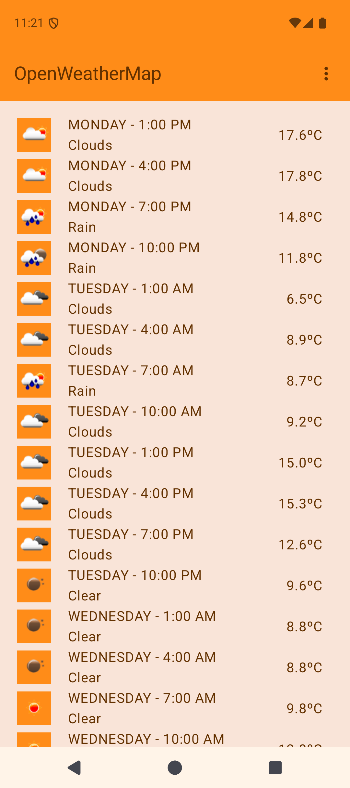

# OpenWeatherMap App #

An app that displays 5 day weather forecast from http://openweathermap.org for London.

App built to experiment with Circuit, Jetpack Compose, Dagger Hilt, Coroutines and Ktor.

| Main Screen |
|:---:|
|  |

### What's the current status ? ###

- The app currently lists 5-day weather forecasts for London
- Allows for switching the temperature scale between Celsius and Fahrenheit
- Swipe to refresh list

### Configuration ###

- This project was build with Android Studio Quail
- It targets SDK 37 and minimum API 23 (Marshmallow)

### What could be done with more time ###

- I would add the option to choose other cities
- Add a Details Screen for a day forecast
- Add more tests

### Libraries Used ###

- Dagger 2 + Hilt
- Slack's Circuit
- Jetpack Compose
- Coroutines
- Ktor
- Kotlin Serializer
- Coil
- ThreeTenABP
- Timber